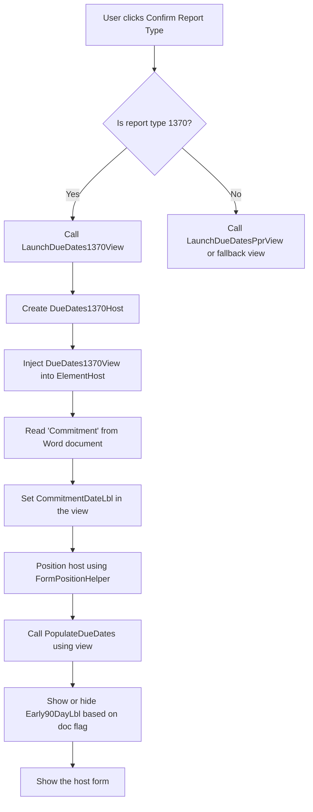
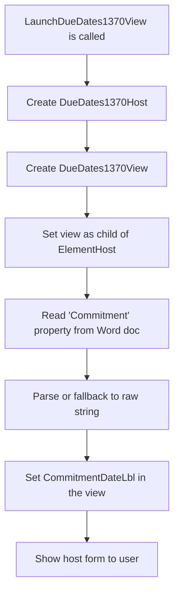

# 📘 EZLogger Workflow: DueDates1370View Launch and Functionality

This document explains the workflow for launching and interacting with the `DueDates1370View` in the EZLogger VSTO Word Add-in. It includes handler responsibilities, view setup, document property integration, and visual diagrams using Mermaid.

---

## ✅ Purpose of DueDates1370View

The `DueDates1370View` is a WPF UserControl embedded inside a WinForms host (`DueDates1370Host.vb`). It is used to:

- Display the **Commitment date** from the Word document's custom properties
- Allow the analyst to calculate and log due dates relevant to California Penal Code §1370 reports
- Write back calculated values (e.g., Days Since Due) to Word document properties

---

## 🧱 Components Involved

| Component | Responsibility |
|----------|----------------|
| `DueDates1370Host.vb` | Hosts the WPF view in a Windows Form with `ElementHost` |
| `DueDates1370View.xaml` | Displays commitment date label and due date selection UI |
| `ReportTypeHandler.vb` | Contains `LaunchDueDates1370View` and performs layout, initialization, and logic wiring |
| Word Document | Stores data like `Commitment` and `Days Since Due` in custom document properties |

---

## 🧠 Handler Responsibilities (`LaunchDueDates1370View`)

- Create host form: `Dim host As New DueDates1370Host()`
- Create and inject WPF view: `host.ElementHost1.Child = view`
- Read `Commitment` date from Word document and populate `CommitmentDateLbl`
- Set layout size and positioning of the form and `ElementHost`
- Wire up logic (e.g., via `DueDates1370Handler.PopulateDueDates(view)`)
- Show the form with `host.Show()`

---

## 🎯 Sample Custom Document Properties Used

| Property Name      | Type   | Purpose                              |
|--------------------|--------|--------------------------------------|
| `Commitment`       | String | Read to display initial date         |
| `Days Since Due`   | Int    | Written to track time delta          |
| `Early90Day`       | Bool/Int | Determines whether to show a label  |

---

## 🧰 View Responsibilities (`DueDates1370View.xaml`)

- `CommitmentDateLbl`: A label to show the commitment date
- `PickDueDate`: A date picker to let the user choose the due date
- `LabelDaysSinceDueDate`: A label that shows the calculated day difference
- `BtnAcceptPPR`: A button to trigger logic (wired via handler or code-behind)
- `Early90DayLbl`: Conditionally shown based on `Early90Day` flag

---

## 📊 Workflow Diagram: Full Report Type Confirmation

---

## 📊 Workflow Diagram: Form Load with Commitment Date

---

## 🧪 Logic Behind PopulateDueDates (Example)

In `DueDates1370Handler`, the method `PopulateDueDates(view)` may:

- Check if a `PickDueDate.SelectedDate` is set
- Compare it with `Today` to calculate delta
- Write the result to the Word doc’s custom property: `Days Since Due`
- Update the view’s label (`LabelDaysSinceDueDate.Content`)

---

## 🔚 Summary

The `DueDates1370View` launch process is carefully managed by `ReportTypeHandler.vb`, following a consistent VSTO+WPF+WinForms hybrid pattern. By using Word document properties and centralized handlers, the logic remains modular, testable, and easy to replicate for views like `DueDatePprView`.

In the next guide, we’ll build the `DueDatePprView` using this same structure.

