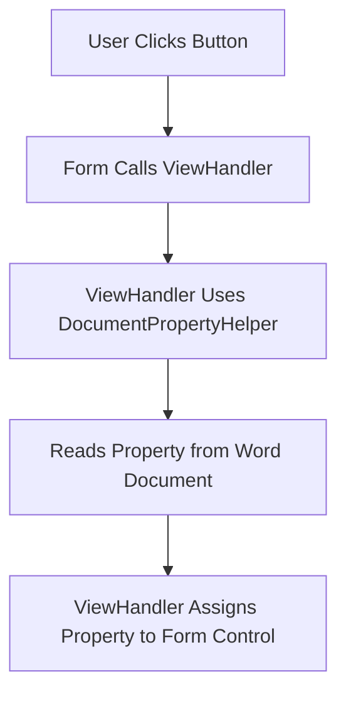

# 📖 How To Load Word Document Properties into Any Form in EZLogger

This guide describes a generalized pattern for retrieving **custom document properties** from an active Word document and loading those values into WPF controls hosted within WinForms in the **EZLogger** VSTO project.

This pattern works across any form in the project and allows for scalable, centralized property loading behavior using shared helper methods and consistent handler architecture.

---

## ✅ Prerequisites

- You are using **VB.NET** with a **WPF UserControl** hosted in a **WinForms ElementHost**.
- The Word document must be open and have the relevant custom document properties defined.
- The control wiring logic lives in a dedicated `Handler` class for each view.
- You are using `DocumentPropertyHelper.GetPropertyValue()` to retrieve document values.

---

## 🔄 General Flow Overview



---

## 💡 Step-by-Step Pattern

### ① Identify the Document Property and Target Control

For each field you want to populate:
- **Property Name in Word:** E.g., "Patient Number"
- **Target Control in Form:** E.g., `TxtPatientId.Text`

Create a map of fields for reuse:
```vb
Dim fieldMap As New Dictionary(Of String, Action(Of String)) From {
    {"Patient Number", Sub(val) view.TxtPatientId.Text = val},
    {"Patient Name", Sub(val) view.LblPatientName.Content = val},
    {"Program", Sub(val) view.LblProgram.Content = val},
    {"Report Date", Sub(val)
        If Date.TryParse(val, Nothing) Then
            view.ReportDatePicker.SelectedDate = Date.Parse(val)
        End If
    End Sub}
}
```

### ② Use DocumentPropertyHelper to Get Values

For each key in the map:
```vb
For Each pair In fieldMap
    Dim value = DocumentPropertyHelper.GetPropertyValue(pair.Key)
    If Not String.IsNullOrWhiteSpace(value) Then
        pair.Value.Invoke(value)
    End If
Next
```

This approach lets you scale up easily by adding more keys without repeating logic.

---

## ⚖️ Best Practices

- **Use consistent naming** for custom properties across all Word documents.
- **Always check for null/empty** values before assigning to controls.
- **Prefer centralized handlers** over inline code-behind logic.
- **Use Try/Catch** when accessing Word to handle missing documents or properties.
- **Use a helper class** (like `DocumentPropertyHelper`) to isolate Office interop logic.

---

## 🚀 Advanced: Create a Reusable Loader Method

In your handler base or shared utilities:
```vb
Public Sub LoadPropertiesToView(view As Object, mappings As Dictionary(Of String, Action(Of String)))
    For Each pair In mappings
        Dim value = DocumentPropertyHelper.GetPropertyValue(pair.Key)
        If Not String.IsNullOrWhiteSpace(value) Then
            pair.Value.Invoke(value)
        End If
    Next
End Sub
```

Then in your specific view handler:
```vb
LoadPropertiesToView(view, New Dictionary(Of String, Action(Of String)) From {
    {"Patient Number", Sub(val) view.TxtPatientId.Text = val},
    {"Classification", Sub(val) view.LblClassification.Content = val}
})
```

---

## 🌐 Where This Works in EZLogger

This pattern is perfect for any view where you want to load document-linked metadata:
- `SaveFileView`
- `ReportTypeView`
- `UpdateInfoView`
- `FaxCoverView`
- Any future forms like `LogThisView`

You can expand the mappings as the project grows.

---

## 📆 Future Ideas

- Add reverse logic: save from control back to document
- Create a Form-to-Property validator
- Highlight missing properties visually in the form
- Allow config-based mapping definitions (e.g., from JSON)

---

With this pattern, you can wire up any document field to any control in your project cleanly and consistently. 

