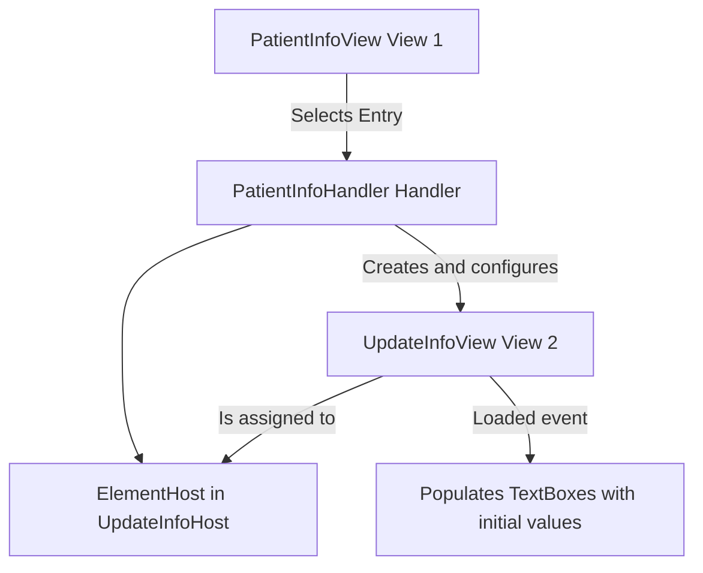

# About This Article

This article explains how to transfer values between WPF views when working inside a VSTO Add-in using WinForms ElementHost containers. Specifically, it covers the common use case of transferring selected data from one view (such as `PatientInfoView`) into another view (such as `UpdateInfoView`) when the views are hosted separately in Windows Forms. This is a common challenge when not using full MVVM binding and instead relying on event-driven handlers.

## Applies To
- VB.NET VSTO Word Add-ins
- WPF Views hosted in ElementHost
- Projects following a hybrid MVVM or handler-based architecture

## Prerequisites
- Basic understanding of WPF UserControls
- Familiarity with wiring events using `AddHandler`
- Use of ElementHost to display WPF controls inside Windows Forms

## Problem
When displaying a new form (or UserControl) such as `UpdateInfoView`, you may want to pre-fill certain fields (like a `TextBox`) with values selected from a different view (like `PatientInfoView`). However, if you try to set the values directly when creating the form, they may not show up because the controls haven't finished loading.

## Mermaid Diagram



This diagram shows the flow of control and data:
1. User selects an item in `PatientInfoView`
2. `PatientInfoHandler` receives the selection
3. `UpdateInfoView` is instantiated and passed to the ElementHost in `UpdateInfoHost`
4. Public properties are used to pass data
5. Values are applied in `Loaded` event handler

## Solution
The recommended solution is to use **public properties** on the target view (e.g., `UpdateInfoView`) to store values ahead of time, and then **apply those values inside a `Loaded` event handler**.

## Steps

### Step 1: Add Public Properties to the Target View
In `UpdateInfoView.xaml.vb`:

```vbnet
Public Property InitialPropertyName As String = ""
Public Property InitialPropertyValue As String = ""
```

### Step 2: Add a Loaded Event Handler
Still in `UpdateInfoView.xaml.vb`, inside the constructor (`Sub New()`):

```vbnet
AddHandler Me.Loaded, AddressOf UpdateInfoView_Loaded
```

Then implement the handler:

```vbnet
Private Sub UpdateInfoView_Loaded(sender As Object, e As RoutedEventArgs)
    TxbxPropertyName.Text = InitialPropertyName
    TxtbxPropertyValue.Text = InitialPropertyValue
End Sub
```

### Step 3: Set the Properties Before Showing the View
In your handler class (e.g., `PatientInfoHandler.vb`):

```vbnet
Dim hostForm As New UpdateInfoHost()
Dim updateView As New UpdateInfoView(hostForm)

' Manually assign this view to the ElementHost
hostForm.ElementHost1.Child = updateView

If selectedEntry IsNot Nothing Then
    updateView.InitialPropertyName = selectedEntry.PropertyName
    updateView.InitialPropertyValue = selectedEntry.Value
End If

hostForm.Show()
```

## Why This Works
The WPF `Loaded` event fires only after the visual tree has been fully constructed. Setting `.Text` directly before this point (especially when the form is not yet shown) may silently fail. This pattern ensures reliable and repeatable value transfer.

## Alternatives
- **MVVM Binding:** You could bind `TextBox.Text` to a ViewModel property, but this adds more complexity and doesn't always work well in WinForms-hosted VSTO setups.
- **Constructor Injection:** While you can pass values directly into the constructor, they still must be applied in `Loaded` to guarantee the controls are ready.

## Best Practices
- Always use public properties on the target view for passing data.
- Use `Me.Loaded` to defer value application until the control is visually ready.
- Manually assign the view to the `ElementHost1.Child` to ensure you're working with the same instance you set properties on.

## Example
A typical scenario is copying a selected document property from `PatientInfoView` and showing it for editing in `UpdateInfoView`. The above steps walk through that real-world use case.

## Summary
When working in a WinForms-hosted WPF environment inside a VSTO add-in, transferring values between views requires careful attention to control initialization timing. Use public properties and the `Loaded` event to reliably transfer and apply values before the view is shown. The included diagram illustrates the data flow from selection to rendering, making the process easier to visualize and replicate.

