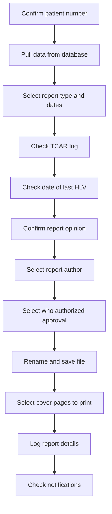

# Flow of processing a report

```mermaid
flowchart TD

    Step1[Confirm patient number]
    Step2[Pull data from database]
    Step3[Select report type and dates]
    Step4[Check TCAR log]
    Step5[Check date of last HLV]
    Step6[Confirm report opinion]
    Step7[Select report author]
    Step8[Select who authorized approval]
    Step9[Rename and save file]
    Step10[Select cover pages to print]
    Step11[Log report details]
    Step12[Check notifications]

    Step1 --> Step2 --> Step3 --> Step4 --> Step5 --> Step6 --> Step7 --> Step8 --> Step9 --> Step10 --> Step11 --> Step12
```
<!-- @nested-tags:prd -->